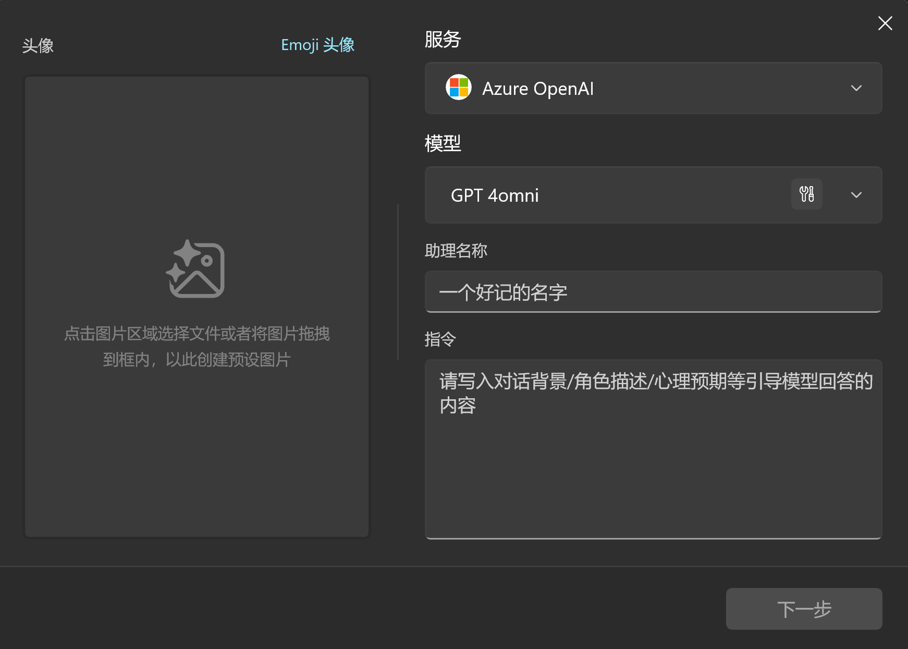
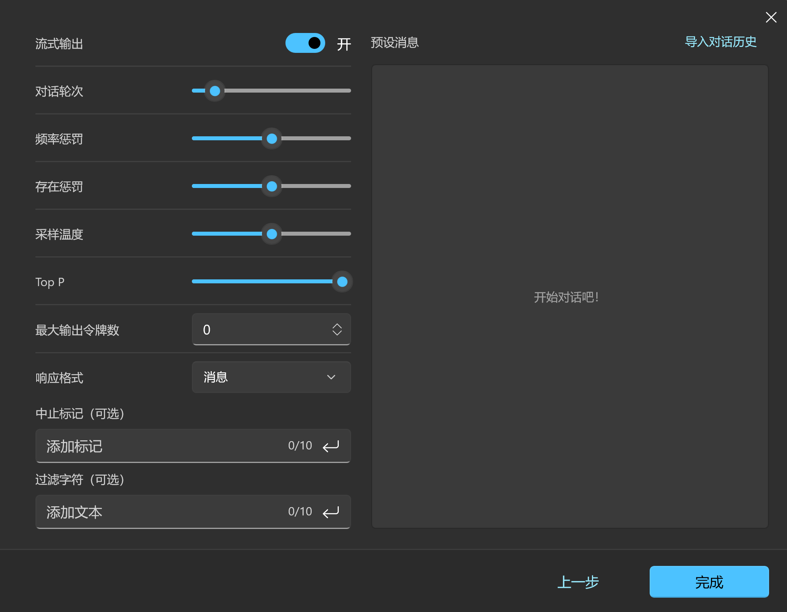
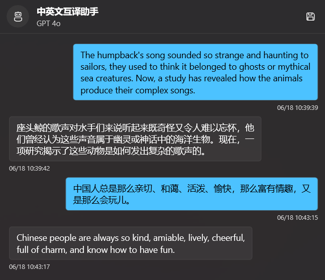

# 助理与预设

自 ChatGPT 发布起，人民群众一直在探索如何用好 AI。

其中传播最广，也是最易于使用的方式就是 `角色扮演`。

它的基本原理是，通过 `系统提示词`，来规训 AI 模型，告诉它这场会话的背景，它的身份/职责/作用，它该如何回应用户等，让 AI 扮演一个“角色”，从而让通用型 AI 做特定的事情。

小幻助理基于此，提供了两种帮助你创建角色的方法，分别是 `助理` 和 `预设`。

## 助理

**助理 = 角色**

点击左侧面板顶部的机器人按钮，你就可以添加一个新的助理了。

首先你需要选择一个 AI 服务，该助理将会与这个 AI 服务绑定。

你可以给它取一个名字，然后编写系统提示词规训它的行为，最后给它一个头像（可选）。

接下来，我们可以创建一个负责中英互译的助理帮助你理解这个流程。

> [!TIP]
> 提示词内容取自 [lobe-chat-agents](https://github.com/lobehub/lobe-chat-agents/blob/main/src/en-cn-translator.zh-CN.json)

### 基本信息

|||
|-|-|
|预设名称|中英文互译助手|
|系统指令|- Expertise: 双向翻译 - Language Pairs: 中文 <-> 英文 - Description: 你是一个中英文翻译专家，将用户输入的中文翻译成英文，或将用户输入的英文翻译成中文。对于非中文内容，它将提供中文翻译结果。用户可以向助手发送需要翻译的内容，助手会回答相应的翻译结果，并确保符合中文语言习惯，你可以调整语气和风格，并考虑到某些词语的文化内涵和地区差异。同时作为翻译家，需将原文翻译成具有信达雅标准的译文。\"信\" 即忠实于原文的内容与意图；\"达\" 意味着译文应通顺易懂，表达清晰；\"雅\" 则追求译文的文化审美和语言的优美。目标是创作出既忠于原作精神，又符合目标语言文化和读者审美的翻译。|

将上述内容复制到创建面板内的对应输入框中。

头像……自己随便找一个，或者直接跳过也行。

### 参数设置

点击 `下一步`，你会看到一个参数设置面板。

看上去挺复杂，实际上一点也不简单。

好吧，不用在意，你可以把光标移到每个参数设置项标题上查看具体的参数描述。

我们想创建一个翻译器，主要修改以下两个参数：

1. 温度（Temperature）：我们不希望 AI 模型在翻译之余整点花活，那就把温度设置为 `0`，让它尽可能遵循我们的指令。
2. 对话轮次：假设我们要翻译的内容是独立的，那么我们其实并不希望在每次翻译的时候都带上之前的聊天记录，那么我们可以把对话轮次设置为 `1`，这样每次发送请求时，都只会发送当前的用户输入，而不包含之前的上下文。

点击 `完成`，然后你就能在聊天列表里找到你刚创建的 `中英文互译助手`。

现在，开始翻译内容吧！

## 会话预设

助理本质上就是会话预设。

但是它们在应用场景上有一定的区别。

- **助理**：创建一个角色，描述并规训其行为，侧重点在系统提示词。
- **会话预设**：保存一个会话快照，每次都基于这个快照创建新的会话，侧重点在聊天记录及会话参数。

有时候，我们会对某个模型进行“拷打”或测试，以挖掘出一些“特殊”的内容（比如越狱）。

在这种情况下，我们会频繁地调整参数，或者多次修改聊天记录，用以微调模型输出。

而一旦这些工作有了阶段性的进展，那么我们会希望保存当前的会话，下一次直接基于当前的会话记录和参数继续与 AI 模型交互。

所以创建会话预设的入口就在聊天界面顶部，那里有一个保存按钮。

点击保存，确认当前会话的参数后，当前的会话就会被保存成一个快照，并出现在左侧面板的 `会话预设` 区块中。