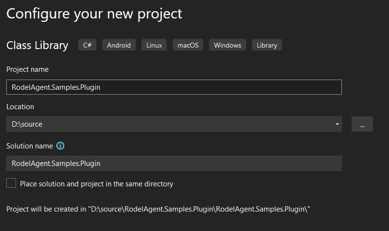
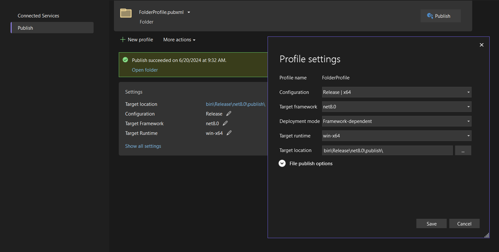
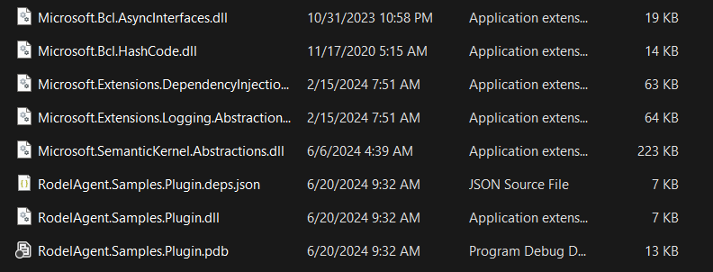

# Plugin Development

> [!TIP]
> Currently, Rodel Agent's plugins have only been tested on C#. There have been no additional tests on Python and Java, so their functionality is not guaranteed.

## Principle

The overall operational architecture of Rodel Agent is based on [semantic-kernel](https://github.com/microsoft/semantic-kernel). The plugin part corresponds to [Native Functions](https://learn.microsoft.com/en-us/semantic-kernel/agents/plugins/using-the-kernelfunction-decorator?tabs=Csharp).

If you need to develop plugins for Rodel Agent, you are essentially creating a Class Library, then introducing relevant packages of the semantic kernel, following the [Native Functions](https://learn.microsoft.com/en-us/semantic-kernel/agents/plugins/using-the-kernelfunction-decorator?tabs=Csharp) guidelines to build the plugin, publish the DLL, and then import the assembly into Rodel Agent. Rodel Agent will use reflection to obtain the list of functions defined in your code, thus realizing local function calls in the semantic kernel.

## Development Environment

| | |
|-|-|
| Development Tools | Visual Studio 2022 or Visual Studio Code |
| SDK | .NET 8 |

## Create Project

For simplicity, create a Class Library based on .NET 8 (it can actually be any .NET version, including .NET Standard 2.0 / .NET 6, etc., but not .NET Framework). We can name it `RodelAgent.Samples.Plugin`.



> [!TIP]
> The sample code created in this article is here: [Samples](https://github.com/Richasy/Rodel.Agent/tree/main/src/Samples/RodelAgent.Samples.Plugin)

## Import nuget Packages

We only need to use `KernelFunction` and other features, so just import [Microsoft.SemanticKernel.Abstractions](https://www.nuget.org/packages/Microsoft.SemanticKernel.Abstractions/).

After importing, the `csproj` file looks like this:

```xml
<Project Sdk="Microsoft.NET.Sdk">

  <PropertyGroup>
    <TargetFramework>net8.0</TargetFramework>
    <ImplicitUsings>enable</ImplicitUsings>
    <Nullable>enable</Nullable>
  </PropertyGroup>

  <ItemGroup>
    <!-- The version below is not necessarily accurate, just need to be the latest version -->
    <PackageReference Include="Microsoft.SemanticKernel.Abstractions" Version="1.14.1" />
  </ItemGroup>

</Project>
```

## Create Plugin Type

The first naming convention of Rodel Agent:

> [!IMPORTANT]
> Plugin types should have the `Plugin` suffix.

Suppose we want to create a weather plugin, then we need to create a new class in the project: `WeatherPlugin`:

```csharp
using System.ComponentModel;
using Microsoft.SemanticKernel;

namespace MyPlugins.Test;

[DisplayName("Weather Plugin")]
[Description("This plugin can get weather-related information.")]
public sealed class WeatherPlugin
{
}
```

In the above type definition, we need to use `DisplayNameAttribute` for the title of the plugin and `DescriptionAttribute` for the description of the plugin. They will be displayed in the plugin list of the application.

<div style="max-width:320px">


</div>

## Implement Methods

Now we need to add a method that can get the weather. Here, we use a pseudo-code, which you can replace with a specific implementation.

```csharp
[KernelFunction]
[Description("Get the weather of a city.")]
public async Task<string> GetWeatherAsync(
    [Description("City name")]string city,
    CancellationToken cancellationToken = default)
{
    await Task.Delay(1000, cancellationToken);
    var testText = "The weather of " + city + " is sunny. 26℃.";
    return testText;
}
```

First, we create an asynchronous method named `GetWeatherAsync` because actual code usually involves network requests, which are asynchronous.

Then, we need to add two attributes to this method.

| | |
|-|-|
| KernelFunctionAttribute | Identifies that this is a callable method |
| DescriptionAttribute | Provides a description of the method. It is best to use English, as this helps the model determine whether to call this method |

`GetWeatherAsync` has two parameters.

The first is a required parameter, which is the city name here. You can use `DescriptionAttribute` to explain it.

The second is a required parameter for asynchronous methods, which is `CancellationToken`. During the whole process of calling the tool, if the user clicks cancel, this termination token will spread from the application to this method, thus stopping the execution of the method.

In this method, we simply return a dynamic text.

Now, we have completed the coding work of the plugin.

How simple is that?

## Packaging

After completing the plugin coding, the next step is packaging.

Right-click on the project and select `Publish`. You can package and publish the plugin according to the following configuration (choose the publishing location by yourself):



After creating the configuration, click the `Publish` button in the upper right corner of the publishing page.

> [!TIP]
> If you are preparing to publish for ARM64, please select Release | ARM64, and the corresponding win-arm64 runtime.

Wait for the publishing build to complete, then open the publishing folder, you will see a bunch of dll files.



Next, select all, right-click, and compress into a ZIP file.

Most importantly, you need to rename the compressed file to your project name, that is `RodelAgent.Samples.Plugin.zip`.

This is the second naming convention of Rodel Agent:

> [!IMPORTANT]
> **When importing plugins, Rodel Agent will look for a dll file with the same name as the ZIP in the compressed package, and import it as an assembly. Therefore, the name of the plugin package must match the name of the dll you want to import.**

### About Icons

You can create an icon for your plugin. This is the third naming convention of Rodel Agent:

> [!IMPORTANT]
> You can add an image named `favicon.png` in the compressed package as the plugin icon.

## Import

Refer to [Tool Calling](./chat-tools#导入工具插件) to import the ZIP compressed package into Rodel Agent.

## Plugin Update

In Rodel Agent, plugins are loaded in the form of importing external DLLs. During the running of the application, new ZIPs cannot directly replace old plugins.

If you need to update the plugin, please close Rodel Agent, delete the corresponding plugin folder in the `Plugins` subfolder of the assistant library folder, then open the application and re-import the new plugin.

## Q&A

1. **Why use `Publish`, can't we use the directly built DLL?**  
    Choosing `Publish` is because it can include all the DLLs that this project depends on. When loading the main DLL file, if dependencies are missing, Rodel Agent will search for dependencies in the plugin directory and load them.  
    Directly using the built DLL is likely to cause dependency issues.

2. **Why is the plugin list empty after I imported the plugin?**  
    Clearly, something went wrong.  
    Please open the settings page, open the application log folder, find the log of the day, open and view the log records, and troubleshoot accordingly.

3. **Can there be multiple plugins in one project?**  
    Yes, one plugin per type is fine. After importing, each plugin type is a plugin entry, sharing the same icon.