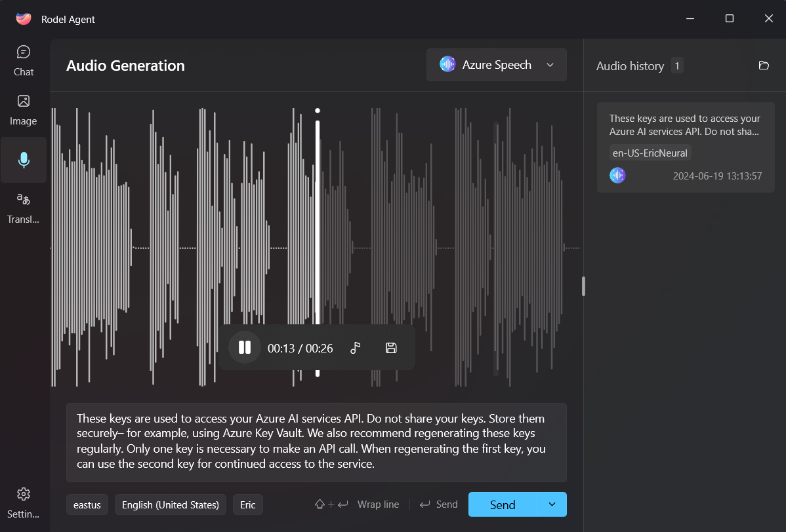

# Text-to-Speech

After completing the [Text-to-Speech service configuration](./tts-config), you can now access the Text-to-Speech interface from the sidebar.

## Voice Selection

Rodel Agent provides basic selection options at the bottom of the input box.

The first button is for model selection. For instance, with OpenAI services, you can choose either `tts` or `tts-hd`. For Azure TTS, since there is no concept of a model, it defaults to the Region you specified.

The second button is for language selection. For OpenAI and Azure OpenAI services, this option can be ignored as the service will automatically determine the input language. However, for Azure TTS, different languages will offer different voice options.

The third button adjusts the specific voice tone. The application will label the gender of the voice, so choose according to your needs.

## Voice Synthesis and Management

In simple terms, after selecting the voice, you can enter the content in the input box and click `Send`. The service you selected will help convert the entered text into audio.

Rodel Agent uniformly saves audio data in **wav** format.

Generated audio is stored in the `Speech` folder within the working directory, and the file name corresponds to the audio session ID.

You can view the generation history within the application, click on a history entry to listen within the app.

You can also open the audio with other apps or save it to other locations on your device.