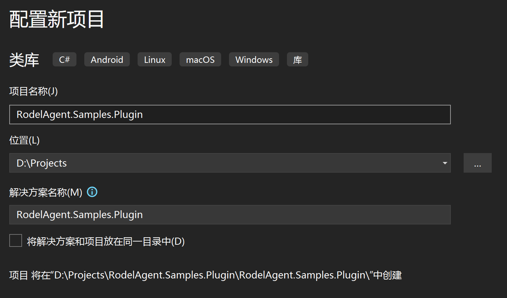
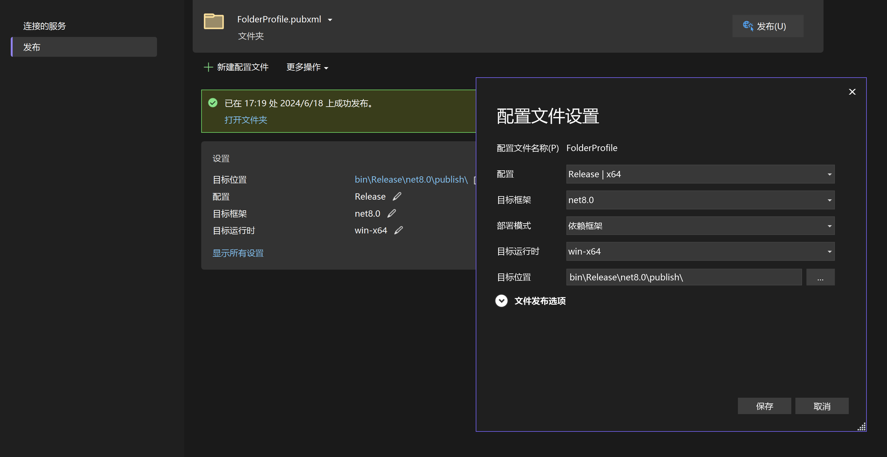
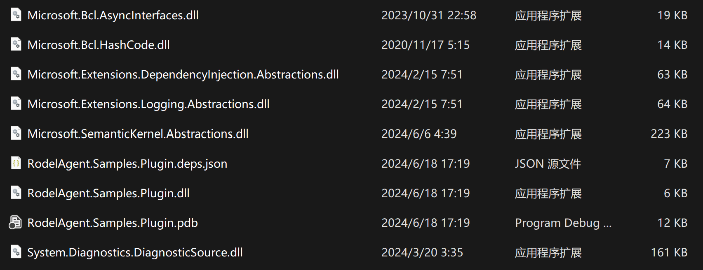

# 插件开发

> [!TIP]
> 目前小幻助理的插件仅在 C# 上进行了测试，python 和 java 没有做额外测试，不保证能工作。

## 原理

小幻助理的整体运行架构基于 [semantic-kernel](https://github.com/microsoft/semantic-kernel)。而插件部分对应的是 [Native Functions](https://learn.microsoft.com/en-us/semantic-kernel/agents/plugins/using-the-kernelfunction-decorator?tabs=Csharp)。

如果你需要为小幻助理开发插件，那么实际上就是创建一个类库（Class Library），然后引入 semantic kernel 相关的包，按照 [Native Functions](https://learn.microsoft.com/en-us/semantic-kernel/agents/plugins/using-the-kernelfunction-decorator?tabs=Csharp) 的引导构建插件，发布 DLL，然后把程序集导入到小幻助理中，小幻助理就会通过反射获取你在代码内定义的函数列表，从而实现 semantic kernel 中的本地函数调用。

## 开发环境

|||
|-|-|
|开发工具|Visual Studio 2022 或者 Visual Studio Code|
|SDK|.NET 8|

## 创建项目

简单起见，创建一个基于 .NET 8 的类库即可（其实可以是任意 .NET 版本，包括 .NET Standard 2.0 / .NET 6 等，但不能是 .NET Framework）。我们可以命名为 `RodelAgent.Samples.Plugin`



> [!TIP]
> 本文所创建的示例代码在这里：[Samples](https://github.com/Richasy/Rodel.Agent/tree/main/src/Samples/RodelAgent.Samples.Plugin)

## 引入 nuget 包

我们只需要使用 `KernelFunction` 等特性，所以只需要引入 [Microsoft.SemanticKernel.Abstractions](https://www.nuget.org/packages/Microsoft.SemanticKernel.Abstractions/) 即可。

引入完成后，`csproj` 文件如下：

```xml
<Project Sdk="Microsoft.NET.Sdk">

  <PropertyGroup>
    <TargetFramework>net8.0</TargetFramework>
    <ImplicitUsings>enable</ImplicitUsings>
    <Nullable>enable</Nullable>
  </PropertyGroup>

  <ItemGroup>
    <!-- 下面的版本不一定准确，只需是最新版即可 -->
    <PackageReference Include="Microsoft.SemanticKernel.Abstractions" Version="1.14.1" />
  </ItemGroup>

</Project>
```

## 创建插件类型

小幻助理的第一个命名约定：

> [!IMPORTANT]
> 插件类型应具备 `Plugin` 后缀。

假设我们要创建一个天气插件，那么我们现在需要在项目里新建一个类：`WeatherPlugin`:

```csharp
using System.ComponentModel;
using Microsoft.SemanticKernel;

namespace MyPlugins.Test;

[DisplayName("天气插件")]
[Description("该插件可以获取天气相关的信息")]
public sealed class WeatherPlugin
{
}
```

在上面的类型定义中，我们需要用 `DisplayNameAttribute` 对应该插件的标题，`DescriptionAttribute` 对应该插件的描述，它们会显示在应用的插件列表中。

<div style="max-width:320px">


</div>

## 实现方法

现在我们需要添加一个方法，该方法可以获取天气，我们在这里使用一个伪代码，你可以替换成具体的实现。

```csharp
[KernelFunction]
[Description("Get the weather of a city.")]
public async Task<string> GetWeatherAsync(
    [Description("City name")]string city,
    CancellationToken cancellationToken = default)
{
    await Task.Delay(1000, cancellationToken);
    var testText = "The weather of " + city + " is sunny. 26℃.";
    return testText;
}
```

首先，我们会创建一个名为 `GetWeatherAsync` 的异步方法，这是因为实际的代码通常涉及网络请求，而这是异步进行的。

然后，我们需要给这个方法添加两个特性。

|||
|-|-|
|KernelFunctionAttribute|标识这是一个可以被调用的方法|
|DescriptionAttribute|提供对该方法的描述，尽量使用英文，这可以帮助模型判断是否要调用这个方法|

`GetWeatherAsync` 有两个参数。

第一个是需要的参数，这里是城市名称，你可以用 `DescriptionAttribute` 来对其进行说明。

第二个是异步方法必须的参数，即 `CancellationToken`，在整个工具调用的过程中，如果用户点击了取消，那么这个终止令牌会从应用内扩散到这个方法，从而中止方法的执行。

在这个方法内，我们简单地返回了一个动态文本。

现在，我们就完成了插件的代码编写工作。

怎么样，是不是很简单？

## 打包

插件代码编写完成，接下来就是打包了。

右键单击项目，选择 `发布`，你可以按照如下配置进行插件打包发布（发布位置自行选择）：



配置创建完成后，点击发布页面右上角的 `发布` 按钮即可。

> [!TIP]
> 如果你准备面向 ARM64 发布，请选择 Release | ARM64，及对应的 win-arm64 运行时。

等待发布构建完成，然后打开发布文件夹，你能看到一堆 dll 文件。



接下来，全选，右键，压缩为 ZIP 文件即可。

最关键的，你需要修改压缩文件的名称为你的项目名称，即 `RodelAgent.Samples.Plugin.zip`。

这就是小幻助理的第二个命名约定：

> [!IMPORTANT]
> **小幻助理在导入插件时，会根据 ZIP 的名称查找压缩包内同名的 dll 文件，将之作为程序集导入，所以插件包的名称必须和你希望导入的 dll 的名称一致。**

### 关于图标

你可以为你的插件创建图标，这是小幻助理的第三个命名约定：

> [!IMPORTANT]
> 你可以在压缩包内添加一个名为 `favicon.png` 的图片作为插件的图标。

## 导入

参考 [工具调用](./chat-tools#导入工具插件) 在小幻助理内导入 ZIP 压缩包即可。

## 插件更新

在小幻助理内，插件是通过导入外部 DLL 的形式加载的，在应用运行期间内，不能直接使用新的 ZIP 替代旧的插件。

如果你需要更新插件，那么请关闭小幻助理，然后在助理库文件夹内的 `Plugins` 子文件夹中删除对应的插件文件夹，之后打开应用，重新导入新的插件。

## Q&A

1. **为什么要使用 `发布`，直接构建的 DLL 能不能用？**  
    选择 `发布`，就是因为它可以包含该项目所有依赖的 DLL，小幻助理在加载主 DLL 文件时，如果发现依赖缺失，那就会在插件目录中寻找依赖并加载。  
    直接使用构建的 DLL 很容易出现依赖缺失的问题。

2. **为什么我导入了插件，但是插件列表一片空白？**  
    显然，有什么地方出问题了。  
    请打开设置页面，打开应用日志文件夹，找到当天的日志，打开查看日志记录，并针对性地进行排查。

3. **一个项目内可以有多个插件吗？**  
    可以的，一个插件一个类型就没问题，导入后，每个插件类型都是一个插件条目，共享图标。