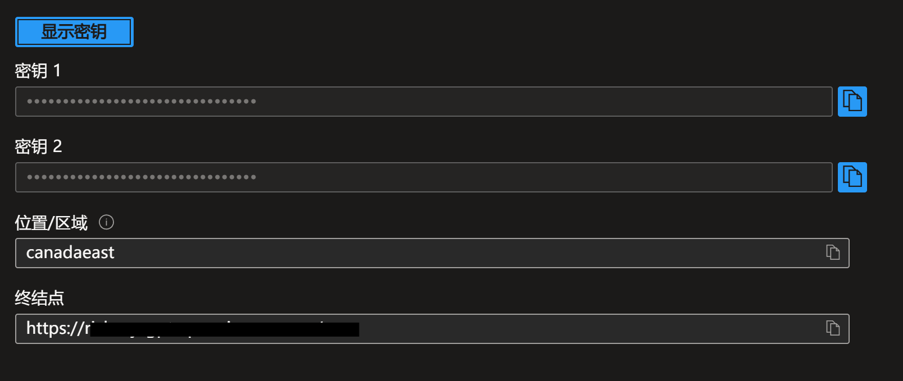
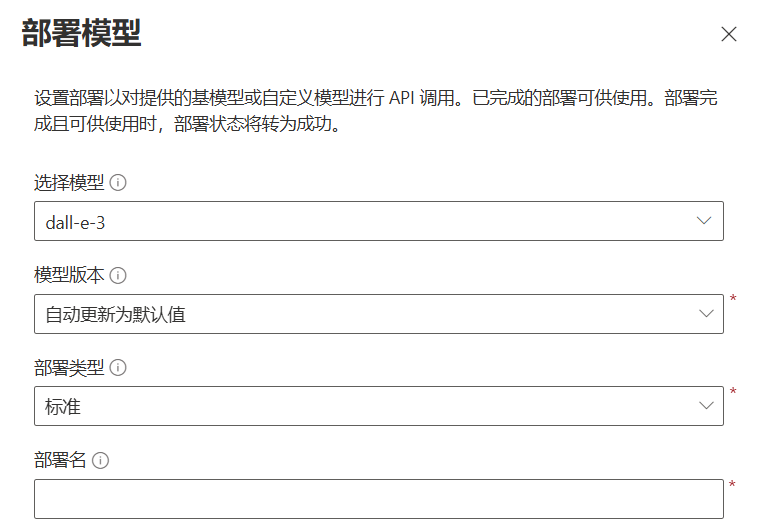

# 文本转语音服务配置

小幻助理支持多种文本转语音服务，请根据子标题索引，跳转到你想要配置的服务段落查看。

## Open AI

|||
|-|-|
|文档|https://platform.openai.com/docs/api-reference/chat/create|
|API 令牌|https://platform.openai.com/account/api-keys|

Open AI 的配置相对来说很简单，只要你将 API Key 填入设置中的 `访问密钥` 即可。

## Azure Open AI

|||
|-|-|
|文档|https://learn.microsoft.com/azure/ai-services/openai/overview|
|Azure 服务|https://azure.microsoft.com/en-us/products/ai-services/openai-service|

Microsoft 与 Open AI 的关系较为特殊，有种 Open AI 特许经销商的感觉，所以你能够在 Azure 这个云服务平台创建 Open AI 资源，并按需部署 `tts` , `tts-hd` 等 Open AI 模型。

虽然它们的模型一致，但是网络请求格式却不尽相同，所需要的配置项也不一样。

当你部署了 Open AI 资源后，你能在资源页面的 `资源管理` -> `密钥和终结点` 中找到所需的密钥（两个密钥任选其一即可）与终结点。

### 添加自定义模型

Azure Open AI 相较于 Open AI，最大的不同在于你需要手动部署需要的模型。

在应用中，Azure Open AI 不提供预置模型，仅仅填写密钥和终结点并不能让配置生效，我们还需要创建自定义模型。

在 [Azure OpenAI Studio](https://oai.azure.com) 中，你可以从模型库里部署特定的模型。

每个模型有自己的 Id，比如 Dall·E 3 的 Id 就是 dall-e-3。

在你部署模型时，Azure 会要求你提供 **部署名**，这个很重要，我们通过 API 与服务进行交互式，模型的标识符不是模型 ID，而是你部署模型时的部署名。

我推荐在部署模型时尽量使用和模型 ID 相同的部署名，以减少歧义。

## Azure TTS

|||
|-|-|
|文档|https://learn.microsoft.com/azure/ai-services/speech-service/text-to-speech|
|Azure 服务|https://azure.microsoft.com/zh-cn/products/ai-services/text-to-speech|

Azure 的语音服务本身包含了语音合成的能力，我们可以根据文档自行部署。

然后将对应资源的 `访问密钥` 和 `区域` 填写进应用设置即可。